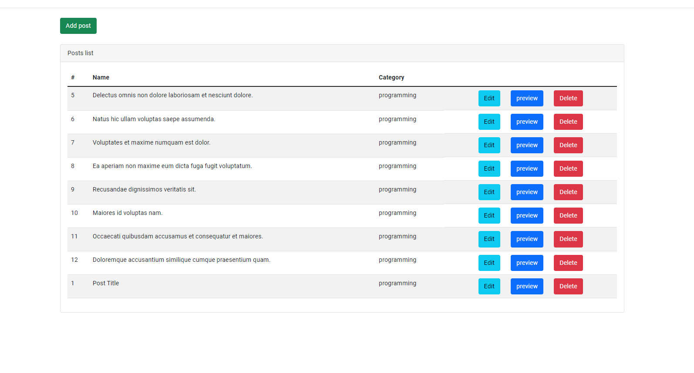
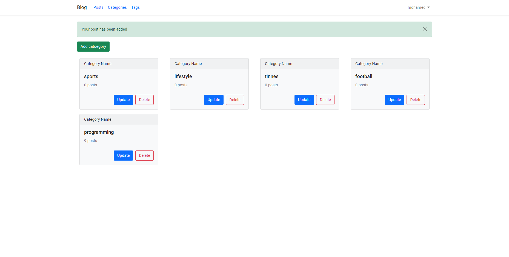
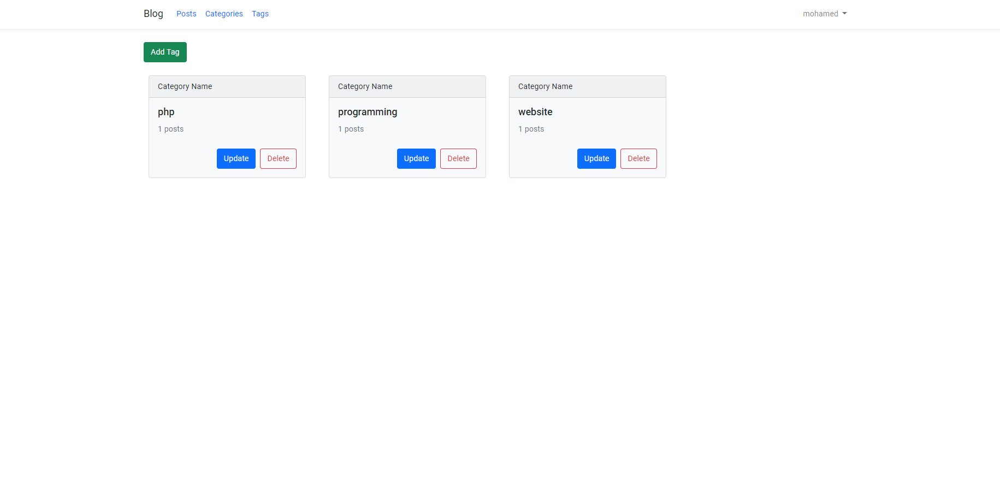
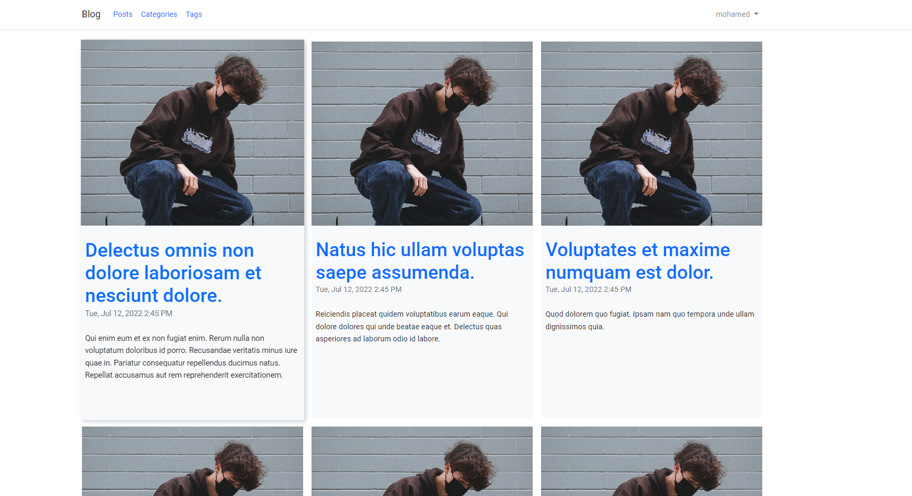

# Personal Blog

This projcet is a basic Personal blog with ability to add, view, update, delete any post, category or even tags.

Database name `bloggit` on port `8111`.

the project consist of two main parts Admin Part and viewer Part

## Start Project

To start this project run

```bash
  php artisan serve
```
### screenshots



